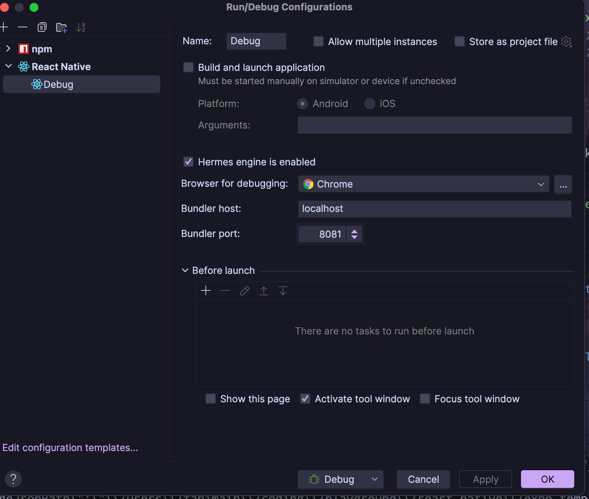

# Setup

1. Follow the detailed instructions to use an [android studio emulator](https://docs.expo.dev/workflow/android-studio-emulator), via android studio, and/or an [iOs simulator](https://docs.expo.dev/workflow/ios-simulator/) with xcode (
   _only possible on macOs_) depending on your operating system
2. Install the [expo plugin](https://plugins.jetbrains.com/plugin/21395-expo) for PyCharm, which provides easy to use templates for setting up and running `React Native` projects using `expo`
3. Click `Create project` and use the installed `expo` template under `Other`

# Debugging with Expo

- Not sure if mandatory, but if an Error like ["can only debug with Hermes"](https://docs.expo.dev/guides/using-hermes/#troubleshooting) occurs, when trying to open the JS debugger (for debugging in Chrome) in the Expo menu, make sure to include `"jsEngine": "hermes"` in the `app.json`
- If this does not work, `cold boot` your emulator
- If you want to debug in PyCharm, you don't have to open the JS debugger in the Expo menu. Instead, execute a `cold boot`, run the app and then run the debug configuration as below.

## In PyCharm

1. Set up a new __React Native__ run configuration in PyCharm
   
2. Run the React Native application with Expo, i.e.
    ```
    npx expo start --ios
    npx expo start --android
    ```
   or
   ```npx expo start```and then `a` or `i`

   or with the scripts provided by the PyCharm `expo` configuration plugin
3. Set debugger points in PyCharm
4. Execute / __DEBUG__ the created Debug configuration
5. PyCharm should stop at the breakpoints

### Notes

- According to the [IntelliJ IDEA React Native documentation](https://www.jetbrains.com/help/idea/react-native.html), one should be able to execute steps 1.) and 2.) in one utilizing the "Before Launch" option in the Run Configuration
- This __DID NOT work__, maybe its not supported by PyCharm yet
- The referenced IntelliJ documentation is much more extensive than the [PyCharm React Native documentation](https://www.jetbrains.com/help/pycharm/react-native.html)
- I pretty much followed the instruction on the [IntelliJ Idea React Native - Debug Expo](https://www.jetbrains.com/help/idea/react-native.html#ws_react_native_debug_expo) section
- The idea to first run the app and then separately the debug configuration came from [here](https://youtrack.jetbrains.com/issue/WEB-61442/Debugger-disconnects-when-debugging-React-Native-Apps-with-Hermes). It is also noted as ONE possibility on the IntelliJ IDEA documentation.
- The `host` and `port` aspects noted in those documentations can be ignored. Maybe `expo` or `metro` changed their default port and host, not sure.

## In Chrome

1. Run the React Native application as described above in point 2.)
2. Press `j` in the terminal running the server to open Chrome DevTools

   or go to the developer menu in the simulator and click `Open JS Debugger`
3. Set the breakpoints in the Chrome DevTools and reload the app

### Notes

- The Chrome breakpoints did not always work as expected. This is also noted on the [Expo Documentation](https://docs.expo.dev/debugging/tools/#pausing-on-breakpoints)
- Had to use `debugger` statements thereafter, which worked as expected
- Above `debugger` statements led to issues when initially hosting the app
- First run the app, then open Chrome DevTools, then insert the `debugger` statements in PyCharm and reload the app